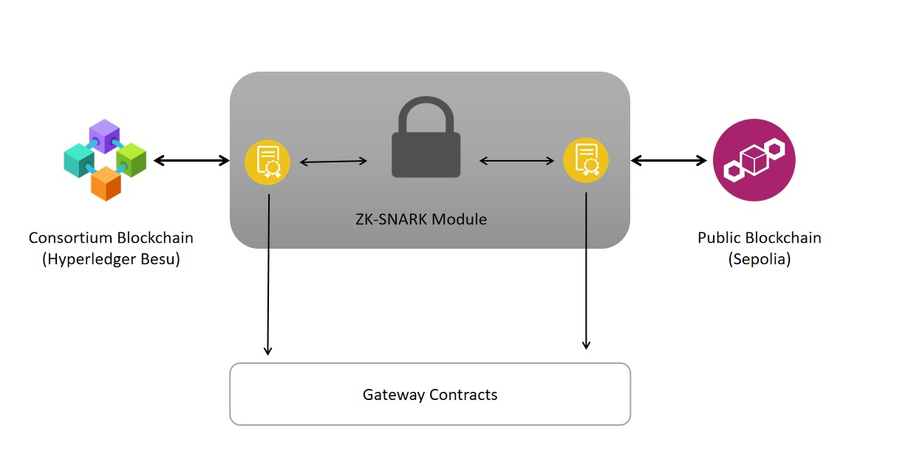
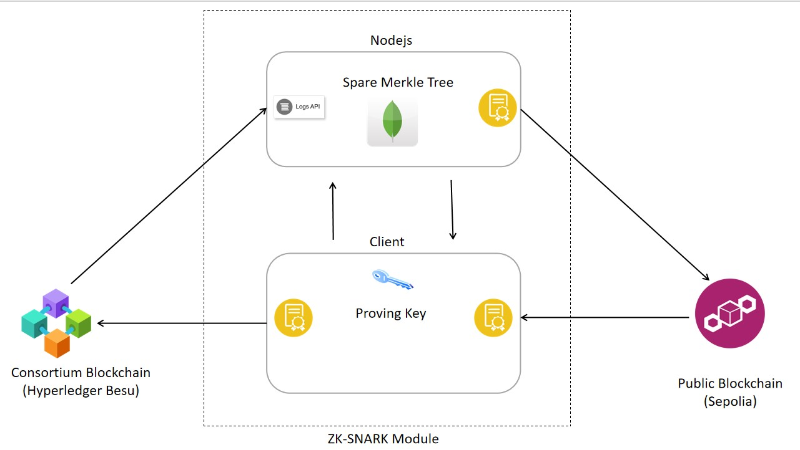
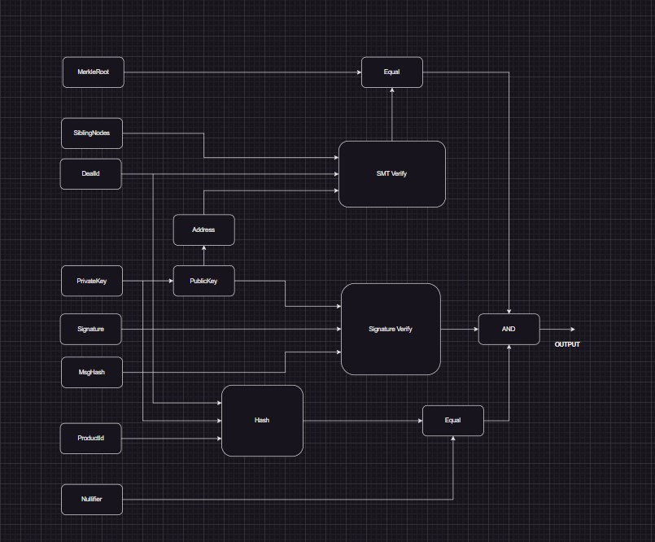

# Dự Án Minh Bạch và Ẩn Danh trong Rating Sản Phẩm trên Sàn Thương Mại Điện Tử

## Giới thiệu
Dự án này tập trung vào việc phát triển một hệ thống rating sản phẩm trên sàn thương mại điện tử, sử dụng công nghệ Zero Knowledge Proof (ZKP) để đảm bảo tính minh bạch và ẩn danh cho người dùng. Hệ thống sẽ sử dụng hai chuỗi: chuỗi riêng (private chain) và chuỗi công khai (public chain).

## Mục Tiêu
- **Tính Minh Bạch**: Đảm bảo tính minh bạch cho các giao dịch và thông tin trên chuỗi riêng.
- **Tính An Đàn**: Ngăn chặn việc sử dụng lại bằng chứng và đảm bảo tính ẩn danh cho người dùng.
- **Tính Ẩn Danh**: Consotium Blockchain cũng không thể biết được phiếu đánh giá đó thuộc về người nào.

## Kiến Trúc Hệ Thống
- **Chuỗi Riêng (Private Chain - Fabric Besu)**: 
  - Chịu trách nhiệm xử lý logic mua bán giữa nhà bán hàng và người dùng.
  - Ghi lại các giao dịch và thông tin liên quan một cách bảo mật.

- **Chuỗi Công Khai (Public Chain - Sepolia)**: 
  - Lưu trữ bằng chứng (Merkle root) được đẩy lên từ chuỗi riêng để chứng minh tính đúng đắn của giao dịch.
  - Đảm bảo rằng các giao dịch có thể được xác minh công khai mà không tiết lộ thông tin nhạy cảm của người dùng.
  - Lưu nullifier (Giá trị duy nhất đại diện cho mỗi giao dịch) để ngăn chặn việc sử dụng lại bằng chứng.
- **Zero-Knowledge (ZkSnark)**:   
  

## Quy Trình Hoạt Động
1. Ghi lại giao dịch mua bán trên chuỗi riêng.
2. Lưu Merkle root của mỗi khối và địa chỉ người mua.
3. Người dùng gửi nullifier lên chuỗi công khai.
4. Người dùng gửi yêu cầu voting.
5. Lấy Merkle Proof để tạo ZK Proof (Private input).
5. Tính toán bằng chứng và gửi bằng chứng về cho backend kiểm tra.
6. Backend(tài khoản khác) gửi bằng chứng kèm với thông tin đánh giá lên contract verify ở chuỗi công khai.
7. Nếu verify thành công, thực hiện voting cho sản phẩm.

## Công Nghệ Sử Dụng
- **Hyperledger Besu**: Để xây dựng chuỗi riêng, cung cấp tính bảo mật và khả năng mở rộng.
- **Ethereum (Sepolia)**: Để triển khai các smart contract và lưu trữ bằng chứng công khai.
- **Zero Knowledge Proof(ZK-Snark)**: Để đảm bảo tính ẩn danh và bảo mật cho người dùng trong quá trình voting.

## Cài Đặt
1. Cài đặt các phụ thuộc cần thiết cho chuỗi riêng và chuỗi công khai.
2. Triển khai chuỗi riêng bằng Hyperledger Besu.
3. Triển khai smart contract trên chuỗi công khai (Sepolia).
4. Chạy ứng dụng và kiểm tra các chức năng.

## Kết Luận
Dự án này không chỉ giúp cải thiện tính minh bạch trong việc đánh giá sản phẩm mà còn bảo vệ quyền riêng tư của người dùng. Với việc sử dụng công nghệ tiên tiến như ZKP, chúng tôi hy vọng sẽ tạo ra một nền tảng thương mại điện tử an toàn và đáng tin cậy hơn.