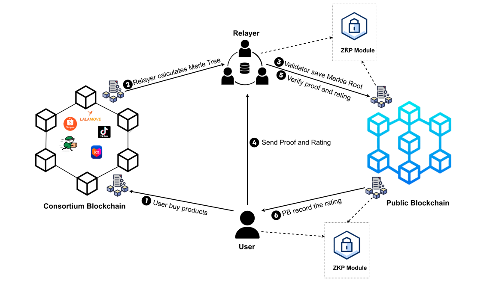
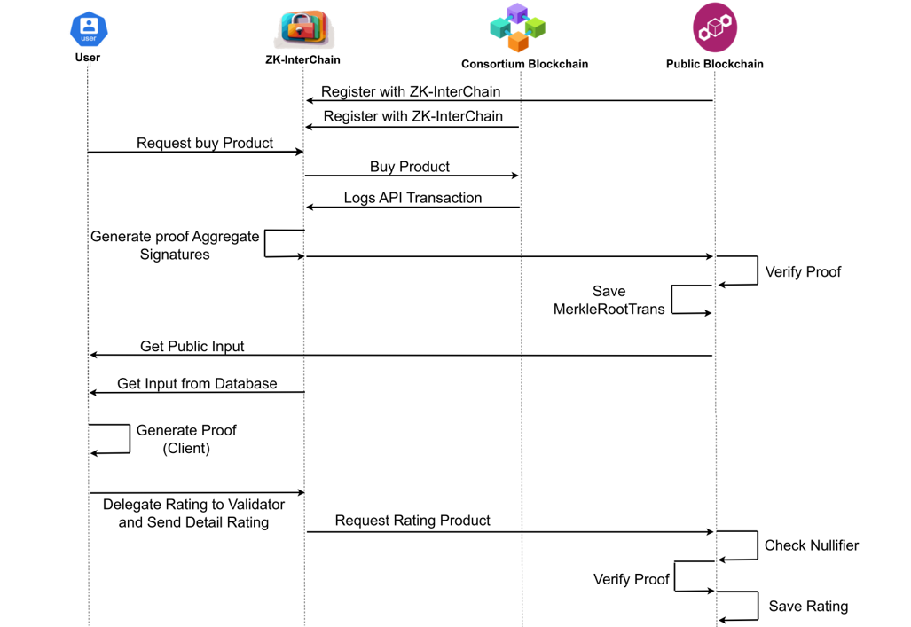
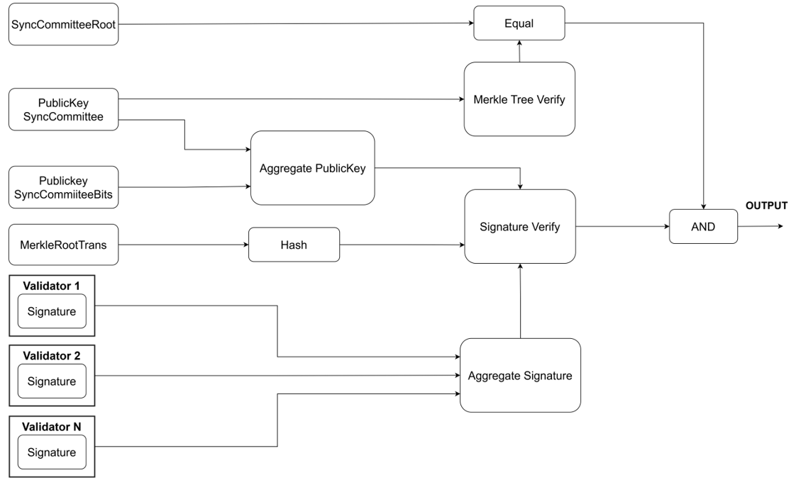
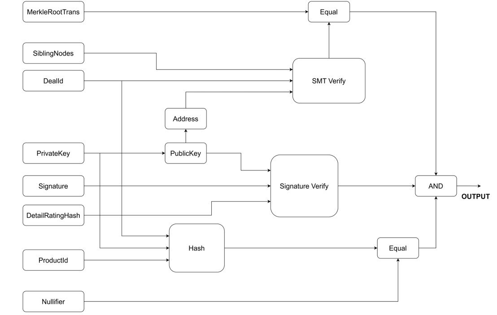

# Dự Án Minh Bạch và Ẩn Danh trong Rating Sản Phẩm trên Sàn Thương Mại Điện Tử


## Giới thiệu
Dự án này tập trung vào việc phát triển một hệ thống rating sản phẩm trên sàn thương mại điện tử, sử dụng công nghệ Zero Knowledge Proof (ZKP) để đảm bảo tính minh bạch và ẩn danh cho người dùng. Hệ thống sẽ sử dụng hai chuỗi: chuỗi riêng (consortium chain) và chuỗi công khai (public chain).

## Mục Tiêu
- **Tính Minh Bạch**: Đảm bảo tính minh bạch cho các giao dịch và thông tin trên chuỗi riêng.
- **Tính Xác thực người dùng**: Xác thực hoạt động hoạt động người dùng ở chuỗi nguồn. Đảm bảo chỉ những người mua hàng ở chuỗi nguồn mới được phép ghi giao dịch trên chuỗi đích.
- **Tính Ẩn Danh**: Ẩn danh hoàn toàn người dùng trên Public Blockchain kể cả Address. Bên trong Consortium blokchain cũng không thể phân biệt được đánh giá đó của ai.

## Kiến Trúc Hệ Thống
- **Chuỗi Riêng (Consortium Chain - Hyperledger Besu)**: 
  - Chịu trách nhiệm xử lý logic mua bán giữa nhà bán hàng và người dùng.
  - Ghi lại các giao dịch và thông tin liên quan một cách bảo mật.

- **Chuỗi Công Khai (Public Chain - Sepolia)**: 
  - Lưu trữ bằng chứng (Merkle root) được đẩy lên từ chuỗi riêng để chứng minh tính đúng đắn của giao dịch.
  - Đảm bảo rằng các giao dịch có thể được xác minh công khai mà không tiết lộ thông tin nhạy cảm của người dùng.
  - Lưu nullifier (Giá trị duy nhất đại diện cho mỗi giao dịch) để ngăn chặn việc sử dụng lại bằng chứng.
- **Zero-Knowledge (ZkSnark)**:   
  - Chúng tôi triển khai 2 Module ZKP trong dự án.
  - Ở Module ZKP đầu tiên được triển khai để chuyển giao trạng thái giao dịch người dùng bên chuỗi nguồn sang chuỗi đích. Đại diện bằng 1 Merkle Root để người dùng dựa vào gốc trạng thái này để thực hiện được Module thứ 2. Trong Relayer chúng tôi triển khai 150 validators nhưng chỉ yêu cầu 100 validators hoạt động tốt để đảm bảo hệ thống chịu lỗi và hoạt động tốt.
  
  - Ở Module ZKP thứ 2 chúng tôi triển khai bên phía người dùng. Với neo là Merkle Root đã được Relayer chuyển giao sang bên trên. Người dùng lấy các input cần thiết để đánh giá và tính toán bằng chứng ZKP. Cuối cùng người dùng gửi bằng chứng này cho Relayer kèm theo phiếu đánh giá chi tiết (Đã được cố định cố định bằng RatingHash trong bằng chứng để Relayer không thể thay đổi đánh giá). Cuối cùng Relayer sẽ đánh giá hộ cho người dùng gánh chịu phí gas cho người dùng.
  

## Quy Trình Hoạt Động
1. Ghi lại giao dịch mua bán trên chuỗi riêng.
2. Lưu Merkle root của mỗi khối và địa chỉ người mua.
3. Người dùng gửi nullifier lên chuỗi công khai.
4. Người dùng gửi yêu cầu voting.
5. Lấy Merkle Proof để tạo ZK Proof (Private input).
5. Tính toán bằng chứng và gửi bằng chứng về cho backend kiểm tra.
6. Backend(Relayer) gửi bằng chứng kèm với thông tin đánh giá lên contract verify ở chuỗi công khai.
7. Nếu verify thành công, thực hiện voting cho sản phẩm.

## Công Nghệ Sử Dụng
- **Hyperledger Besu**: Để xây dựng chuỗi riêng, cung cấp tính bảo mật và khả năng mở rộng.
- **Ethereum (Sepolia)**: Để triển khai các smart contract và lưu trữ bằng chứng công khai.
- **Zero Knowledge Proof(ZK-Snark)**: Để đảm bảo tính ẩn danh và bảo mật cho người dùng trong quá trình voting.

## Cài Đặt
1. Clone dự án về:
    ```bash
    git clone https://github.com/kientt265/-web3-zk-interchain.git
    ```
2. Triển khai chuỗi riêng bằng Hyperledger Besu. Chi tiết cài đặt ở [Cài đặt Consortium Blockchain](https://github.com/kientt265/hyperledger-besu-tessera).
3. Deploy các contract lên Consortium Blockchain:
    ```bash
    # Consortium chain
    cd contracts/src/PrivateChain/Deal.sol
    ```
4. Deploy các contract lên Sepolia:
    ```bash
    cd contracts/src/ChainPublic
    ```
5. Khởi chạy giao diện local:
    ```bash
    cd front
    npm install
    npm run dev
    ```
6. Khởi chạy backend:
    ```bash
    cd back
    npm install
    npm start
    ```
7. Chạy ứng dụng và kiểm tra các chức năng.

## Demo
- Xem chi tiết Demo tại [Demo ZK-InterChain](https://youtu.be/bYCQBsC9EjY)
## Kết Luận
Dự án này không chỉ giúp cải thiện tính minh bạch trong việc đánh giá sản phẩm mà còn bảo vệ quyền riêng tư của người dùng. Với việc sử dụng công nghệ tiên tiến như ZKP, chúng tôi hy vọng sẽ tạo ra một nền tảng thương mại điện tử an toàn và đáng tin cậy hơn.